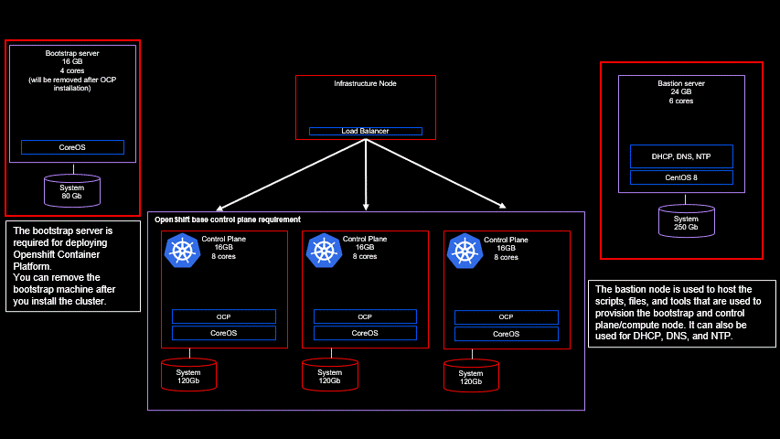

# Guardium

This is a "landing page" for Guardium.  Look here for links to high value technical content specific for this service.

## Guardium Insights

Guardium Insights is a lightweight-but-powerful platform that can flexibly deploy wherever an organization needs - aligning to data security goals without hindering business objectives in the cloud.  Guardium Insights will centralize data security visibility to discover data security and compliance insights across multiple cloud resources.  Insights will provide near real-time data activity monitoring and protection capabilities, agentlessly stream from Database-as-a-Service (DBaaS) sources, such as AWS Kinesis and Azure Event Hubs, and connect to data sources supported by IBM Security Guardium Data Protection central managers.  You can define compliance policy to dictate how and what data is monitored and specifying audit milestones.  All of this can feed data security and compliance reports in seconds, using out-of-the box and advanced, customizable reports and content.

Fianlly, you are able to collaborate across the security operations center (SOC) by sharing data security event data with other security platforms and opening cases in IBM Cloud Pak for Security.  Insights doesn't really DO any of the monitoring and protection, but it gathers the audit trails and reports from your other services which DO perform those functions, and puts it into a common format which it can then report on, alert teams to, and search for suspicious patterns.

### Installing Guardium Insights 3.0.1
These are my notes on installation of Guardium Insights 3.0.1 on ROKS (OpenShift Cluster on IBM Cloud).  This installation is interactive, no Ansible (or similar) scripting is used.  Information regarding scripting may be included in a later revision 

#### Hardware and Operating System requirements
Before beginning the installation of Guardium Insights, you will first need to provision a Redhat Openshift cluster.   
For Guardium Insights version 3.0.x the version of Openshift needs to be v4.6.x.   
[View IBM documentation for hardware requirements for Guardium Insights](https://www.ibm.com/docs/en/guardium-insights/3.0.x?topic=requirements-openshift-container-platform-base-hardware)  
[View IBM documentation for software requirements for Guardium Insights](https://www.ibm.com/docs/en/guardium-insights/3.0.x?topic=planning-system-requirements-prerequisites#sys_req__os) 

I have used a very small cluster for testing.  Your cluster may have many more nodes according to sizing requirements.   Consult with your IBM contact and/or [Knowledge Base documentation on sizing](https://www.ibm.com/docs/en/guardium-insights/3.0.x?topic=planning-hardware-cluster-requirements) for your specific case.  

### Entitlement Key
You will need to get your entitlement key, as described in [Obtain your entitlement key](https://www.ibm.com/docs/en/guardium-insights/3.0.x?topic=installing-prepare-security-guardium-insights#install_prep_insights__entitlement_key). 

### Installation instructions
If any of the following steps fails, please consult the Knowledge Base installation Details at - [See IBM Documentation on Guardium Insights 3.0.x Installation](https://www.ibm.com/docs/en/guardium-insights/3.0.x)  

* [Offline (air gapped) installation](Guardium_offline.md) - Follow this link for notes on air-gapped install
* [Online (connected) installation](Guardium_online.md) - Follow this link for notes on connected install

### Guardium Insights Links
- [Online Documentation](https://www.ibm.com/docs/en/guardium-insights) - Link to the online documentation
- [Guardium by Example: SOX Reporting in Guardium Insights](https://community.ibm.com/community/user/security/blogs/john-haldeman/2021/07/24/sox-reporting-in-guardium-insights?CommunityKey=aa1a6549-4b51-421a-9c67-6dd41e65ef85&tab=recentcommunityblogsdashboard) - a great hands-on article with screenshots and examples walking you through doing your SOX reporting using Guardium Insights.

## Guardium Data Protection

IBM Security Guardium Data Protection supports a zero trust approach to security. It discovers and classifies sensitive data from across the enterprise, providing real-time data activity monitoring and advanced user behavior analytics to help discover unusual activity around sensitive data.  Uncover regulated data in your data stores and use pre-built templates for regulations such as PCI DSS, SOX, HIPAA, GDPR, CCPA and many more, to streamline and automate compliance workflows.  Using a single interface, you can set access policies, monitor user access to protected data and discover, investigate and remediate vulnerabilities and threats as they occur in real time across your data environment.

Find out who is accessing data, when they are accessing it, and easily determine if data is being improperly accessed.

## Guardium Data Encryption

IBM Security Guardium Data Encryption (GDE) consists of a unified suite of products built on a common infrastructure. These highly scalable solutions provide data encryption, tokenization, data masking and key management capabilities to help protect and control access to data across the hybrid multicloud environment. Address data security and privacy regulations such as GDPR, CCPA, PCI DSS and HIPAA by employing methods to de-identify data, such as tokenization and data masking, and managing the encryption key lifecycle with secure key generation and automated key rotation.

## Guardium Vulnerability Assessment

To meet compliance requirements, counter insider and external threats and achieve the principles of zero trust, it’s critical that you understand where vulnerabilities in your database infrastructure lie. IBM Security™ Guardium® Vulnerability Assessment scans data infrastructures such as databases, data warehouses and big data environments to detect vulnerabilities and suggest remedial actions. This vulnerability assessment tool identifies exposures such as missing patches, weak passwords, unauthorized changes and misconfigured privileges. Full reports are provided as well as suggestions to address all vulnerabilities. Guardium Vulnerability Assessment detects behavioral vulnerabilities such as account sharing, excessive administrative logins and unusual after-hours activity. It identifies threats and security gaps in databases that could be exploited by hackers.

## Data Risk Manager

 IBM Data Risk Manager provides executives and their teams a business-consumable data risk control center that helps to uncover, analyze, and visualize data-related business risks so they can take action to protect their business.  It's a way to visualize and consume everything that the rest of the Guardium products are telling you.

## References for Further Reading
- [IBM Security Community](https://community.ibm.com/community/user/security/home) - a community focused on cybersecurity - with technical help and information on the latest happenings and thought leadership.  It is worthwhile to visit and join the community if you are focused on security.
- [The Next Frontier for Data Security: Protecting Data in Use](https://medium.com/@Guardium/the-next-frontier-for-data-security-protecting-data-in-use-692cb0fd5214) - Great blog post and insight on protec ting data in storage, in use, and in transit.  Confidential Computing and Fully Homomorphic Encryption (FHE) are two promising emerging technologies for addressing this concern and enabling organizations to unlock the value of sensitive data.
- [Data Is Quicksand: Does Your Current Data Security Solution Pull You Out or Sink You Deeper?](https://securityintelligence.com/posts/data-security-solution-quicksand/) - a little bit of a marketing pitch - but data security responsibilities today are often split across data security, compliance and security analyst teams. To solve that issue, you need to connect your various security and IT tools, from the SIEM tool to ticketing.  High level look at everything that you can and should do.
- [Thoughts From a Data Security Expert: 3 Things That Keep Me Up at Night](https://securityintelligence.com/posts/data-security-expert-problems-night/) - quick article on the top three things that worry a director in charge of data at a major financial company.
- [What’s New in the 2021 Cost of a Data Breach Report](https://securityintelligence.com/posts/whats-new-2021-cost-of-a-data-breach-report/) - interesting look at some of the statistics and financial impacts of data breaches in 2021.
